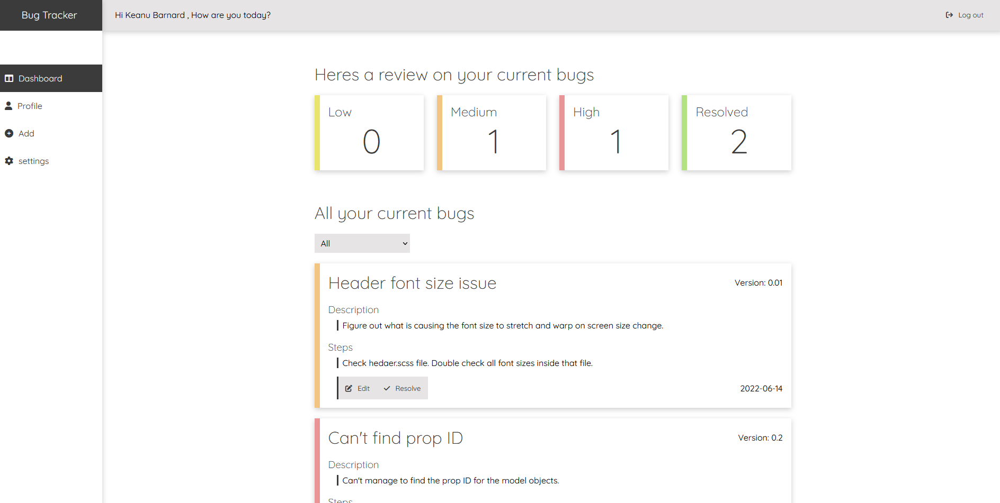
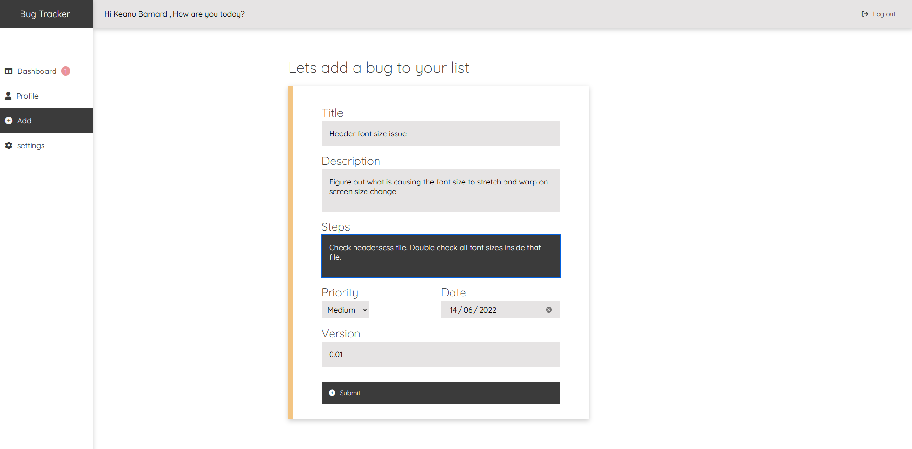
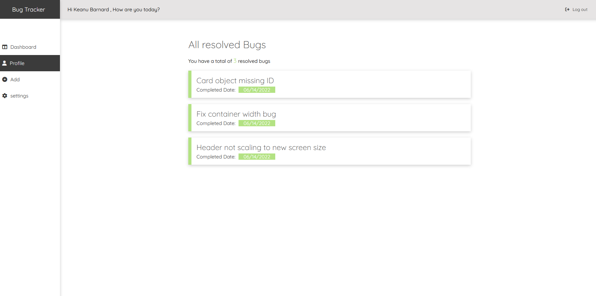

# Bug Tracker 

Still a work in progress project. Looking to add local storage features or a database to store all the data for the bugs. Currently finished as a simple front end C.R.U.D application and can viewed here. https://enchanting-axolotl-d17fee.netlify.app/

## How it works
This is a front end web application built with React, the application allows users to keep track and log bugs they have on their personal projects. Creating a new bug log prompts users to add specific information to define and categorise the bug. Allowing the user to neatly organise and understand which logs need to be completed and how they need to be solved. 

## What was used to create 'Bug Tracker' 
The bug tracker was created mainly with **React, Html, scss and React**. Currently working on making this application full stack incoperating MongoDB and NodeJs for the back end. 
 

# How it works 
The users dashboard stores all of the current bugs that need to be resolved as well as displays the how many bugs you have for each 'priority' handler. Priority is used to determine which bug needs to be completed first and the user can define that on creation or editting of their bug log.    

## Logging Bugs 
Users can log bugs they have found within their own projects. 
The user has to specific what the title of the bug will be. Example: 'Button is'nt changing colour on mouse hover'
 
Then add a description to describe whatever they wish to assist in resolving that problem. Example 'When hovering over the Buy button, the button isn't changing to a bright green when it should be.' 
  
Next the steps input is used to allow users to set up a plan of attack to solve the problem. Example "Step 1: Check the form CSS make sure class has a hover selector" 
 
Then finally we have the Priority, Date and version to finalise the submission of the bug. Priority tells the user how important it is to complete this bug, date is when the bug was lodged and version is the current version in which their project is operating on.    
  

## Completing Bugs
When the user has resolved the bugs it will be added to the resolved section. Which displays all the previously completed bugs with the date completed and title of the bug.  
  

